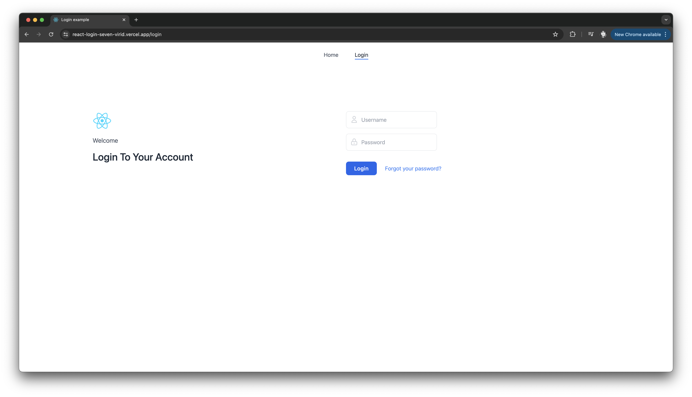
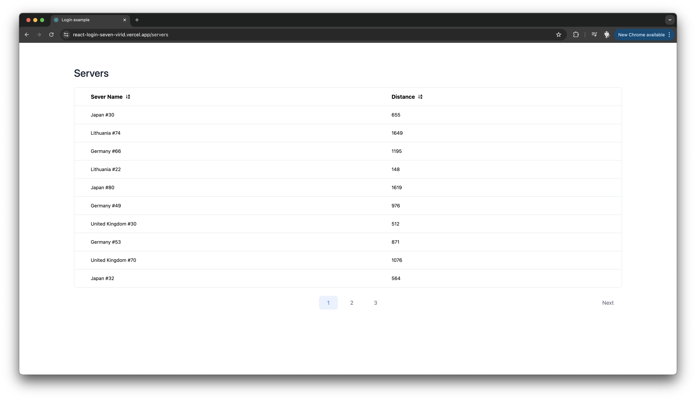

# React Login example

React Login Page example

<br>

## Demo

Demo can be found [here](https://react-login-seven-virid.vercel.app/)

Example screens:



<br>

## Stack

- React
- TypeScript
- ESLint
- Webpack
- React Fast Refresh + Webpack HMR
- Tailwind css
- Jest
- Playwright
- React Router Dom
- React Query

<br />

## Installation

<br>

Clone the repository :

```
git clone git@github.com:hirondelledemer/react-login.git
```

<br>

Install dependencies:

```
yarn install
```

<br />

## Start : Development

To develop and run application, you need to run following command :

```
yarn start
```

<br />

## Lint : Development

To lint application source code using ESLint via this command :

```
yarn lint
```

<br />

## Test : Development

To test application

```
yarn test         // unit tests
yarn test:watch   // unit tests in watch mode
yarn test:e2e     // e2e tests
```

<br />

## Build : Production

Distribution files output will be generated in `dist/` directory by default.

To build the production ready files for distribution, use the following command :

```
yarn build
```

<br />

## Serve : Production

This command serves build files from `dist/` directory.

```
yarn serve
```

<br />

## TODOs

### Product improvements

- Unify heading styles
- Introduce dark mode
- Improve suggestion tooltip

since for demo purposes there is only one user, there might be a button "fill user data" which would fill login form

- Implement table search

additional field above the table where user could search servers by name

- More exiting home page :)
- Use translation manager to make app bilingual

### Code improvements

- Create generic button that would allow create custom buttons (currently one is needed in table component, but in future more might be needed)
- Add storybook for generic components (this would allow nicer preview and testing for components such as button, link, table, etc.)

### Dev experience improvements

- Upload playwright-report folder with Azure Pipelines (this would allow see failing tests more clearly)
- Show Deployment link on PR's

<br />
